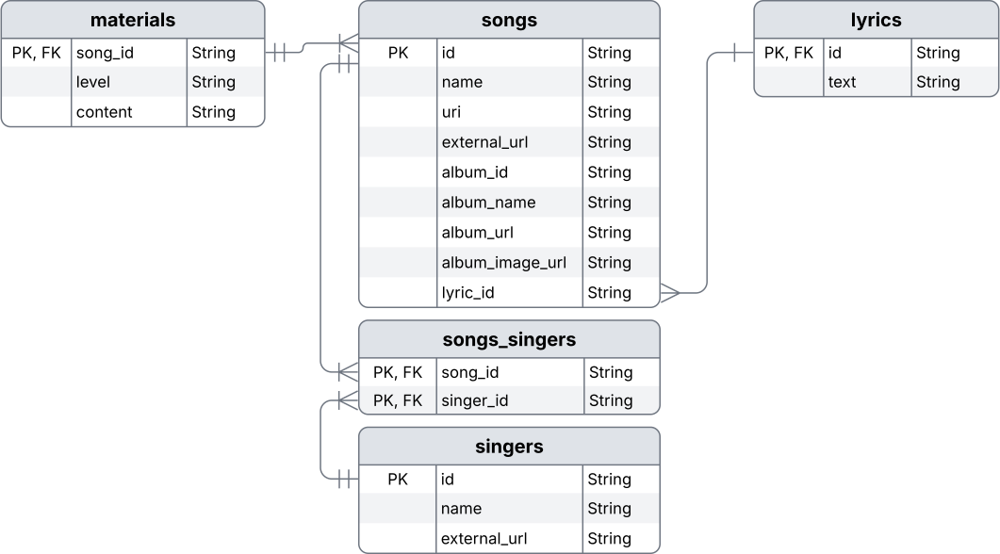

# **LingoBeats**

An application that transforms *songs* into AI-generated *materials* for an engaging language-learning experience.

## **Overview**

LingoBeats will connect to **Spotify** to retrieve songs and **Genius** to fetch lyrics, then analyzes the text using **Zipf frequency** and **CEFR levels** to match content with each learner’s proficiency. 

Leveraging **Wordnik**, it enriches users’ vocabulary understanding through contextual meanings and usage examples. 

Finally, **Gemini AI** generates personalized learning contents and exercises based on the linguistic insights extracted from the previous stages.

By combining music, AI, and intelligent content generation, LingoBeats hopes to turn passive listening into an interactive and personalized learning journey, boosting learners’ motivation.

## **Objectives**

### Short-term usability goals

1. Integrate Spotify and Genius APIs to retrieve and preprocess song and lyric data
2. Analyze word with Zipf, CEFR levels and Wordnik API
3. Get personalized learning materials using Gemini AI

### Long-term goals

1. Expand the platform to support multiple languages and cross-cultural learning
2. Build adaptive learning models that personalize content based on learner progress

## **System Design**

### Entity-Relationship Diagram

  

## **Setup**

1. Sign up for or log in to your **Spotify for Developers** account, create a new project, and obtain your `client_id` and `client_secret`
2. Copy `config/secrets_example.yml` to `config/secrets.yml` and update token
3. Ensure correct version of Ruby install (see `.ruby-version` for `rbenv`)
4. Run `bundle install`
5. Run `bundle exec rake db:migrate` to create dev database
6. Run `RACK_ENV=test bundle exec rake db:migrate` to create test database

## **Running Tests**

### To run tests：

<pre><code>rake spec</pre></code>

### To test code quality：

<pre><code>rake quality:all</pre></code>

## **Running Application**

<pre><code>rake app:run</pre></code>